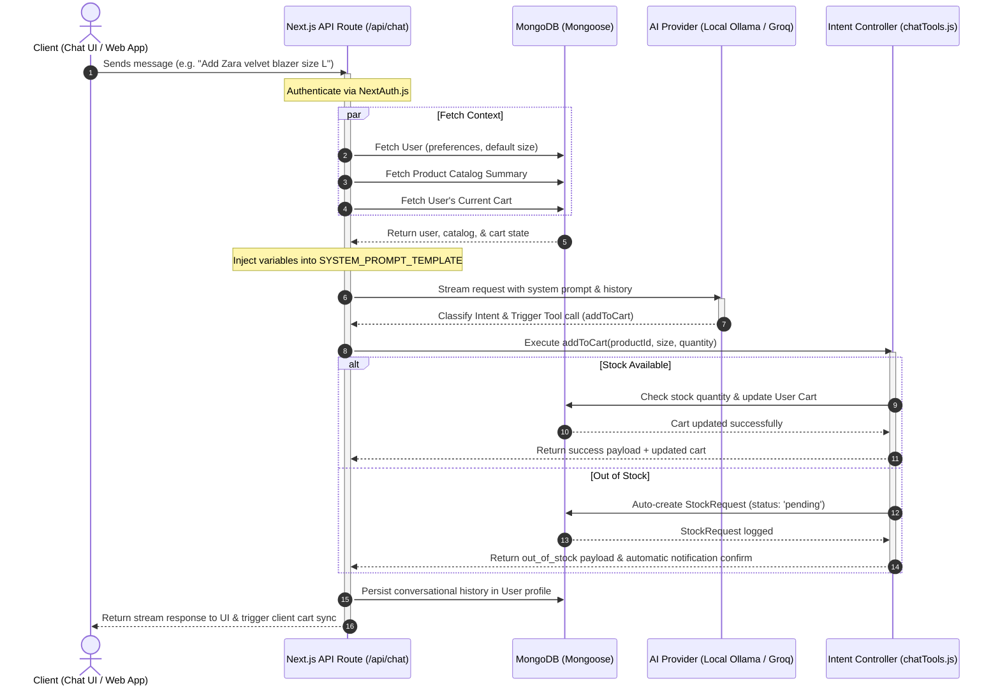

# ⚡ TechDojo AI Bot — Conversational E-Commerce Platform

[](https://nextjs.org/)
[](https://react.dev/)
[](https://tailwindcss.com/)
[](https://www.mongodb.com/)
[](https://sdk.vercel.ai/docs)
[](https://ollama.com/)

An industry-grade, conversational e-commerce application built with **Next.js (App Router)** and **React 19**, powered by a hybrid **AI Brain** that bridges natural language shopping queries with database actions. 

Customers can search clothing products, manage their cart, submit restock requests, and checkout—all inside a single conversational window, with live visual feedback synced in real-time across the client application.

---

## 🏗️ Architecture & AI Request Lifecycle

The system utilizes an intent-routing pattern powered by **Vercel AI SDK**. When a customer messages the assistant, the server constructs a token-optimized system prompt containing user preferences, active catalog details, and current cart context. The LLM determines the user's intent, extracts relevant entities, and maps them to MongoDB operations through a custom tools controller.



---

## ✨ Key Features

### 🧠 1. Dual Intent-Routing & Conversational Engine
The AI distinguishes between **Conversational Chat** (greetings, vague questions, or context-building like *"I have a party tomorrow"*) and **Task Requests** (specific orders, catalog browsing, cart edits).
*   **Conversational Mode**: Engages warmly, asking clarifying questions without touching the database.
*   **Task Mode**: Executes backend routines. The user never sees raw JSON or function markers—the AI processes actions behind the scenes and updates the UI state.

### 🔍 2. Singular/Plural-Resilient Fuzzy Product Search
A custom search tokenizer processes user searches by removing common e-commerce stop-words (e.g., *buy, clothing, details*) and uses a regex pattern builder resilient to pluralization (e.g., searching for *"jeans"*, *"nike tees"*, or *"running shorts"* correctly maps to products).

### 🛒 3. In-Chat Cart & Checkout Lifecycle
Allows customers to query their cart contents, add items by size, adjust quantities, remove items, and complete checkouts directly in the conversation window.
*   **Price Snapshotting**: Item names, images, and prices are frozen in the cart and order documents at the exact time of action, shielding customers from subsequent catalog price updates.
*   **Clean Order Ledger**: Generates structured order documents with a strict append-only `statusHistory` array representing fulfillment states.

### 📋 4. Out-of-Stock Edge Case Handling
If a customer tries to add an item size that is sold out (stock `0` in inventory):
1.  The `addToCart` controller intercepts the request.
2.  It automatically logs a `StockRequest` containing the user's email, product, and requested size.
3.  The LLM informs the customer that the item is out of stock and that a restock notification request has been filed for their email.

### 🔌 5. Hybrid Cloud/Local LLM Support
Supports dynamic routing of AI inferences:
*   **Local LLM Mode**: Powered by **Ollama** running locally on a dedicated graphics processing unit (e.g., RTX 5070) with zero API costs and sub-2s responses using `qwen2.5:14b` or `llama3.1:8b`.
*   **Cloud Failover Mode**: Powered by the **Groq API** (`llama-3.1-8b-instant`) for fast, resilient cloud fallbacks.

---

## 💻 Tech Stack

*   **Framework**: Next.js 16.2 (App Router)
*   **State Management**: React 19 Context API (`CartContext`) for instant, cross-component cart updates.
*   **Styling**: Vanilla Tailwind CSS v4 featuring premium glassmorphism layouts and custom micro-animations.
*   **Database**: MongoDB Atlas connected via Mongoose ODM.
*   **Authentication**: NextAuth.js credentials-based sessions.
*   **AI Integration**: Vercel AI SDK Core (`ai`), `@ai-sdk/openai` (configured for local Ollama compatibility), and `@ai-sdk/groq`.
*   **Validation**: Zod schema validation for type-safe tool inputs.

---

## 🗄️ Database Schemas (MongoDB / Mongoose)

The platform is designed around 6 core collections, structured to maintain data integrity and support AI operations:

### 1. `User`
Manages identities, credentials, embedded addresses, and AI preferences.
*   **AI Personalized Prompting**: Injects `preferences.defaultSize` and `preferences.favoriteCategories` directly into the system prompt to allow personalized search recommendations.
*   **Embedded Addresses**: Realistically restricted to ≤5 per user, addresses are embedded directly inside the document to prevent unnecessary lookup queries.

### 2. `Product`
The master catalog layout.
*   **Per-Size Inventory Map**: Features a structured object mapping stock levels (`S`, `M`, `L`, `XL`, `XXL`) to enable precise real-time checks.
*   **AI Keywords**: A `tags` array powers fuzzy matching search queries.

### 3. `Cart`
Stores active shopping bags.
*   **TTL Auto-Expiry**: Includes a TTL index on `expiresAt`, which automatically cleans up guest checkout carts after 7 days, maintaining a clean database state.

### 4. `Order`
Immutable ledgers representing completed transactions.
*   **Fulfillment History**: `statusHistory` records state updates (confirmed, processing, shipped, delivered) chronologically.

### 5. `ChatSession`
Persists conversation logs.
*   **Window Slits**: The API route pulls only the last 6 messages to keep token usage low, while `context.lastIntent` acts as short-term memory to bridge conversational context.

### 6. `StockRequest`
Tracks restock alerts.
*   **Admin Hooks**: When inventory levels are replenished, a background notification script queries pending requests for that SKU, alerts users via email, and sets the status to `notified`.

---

## 🛠️ Project File Structure

```
techdojo-ai-bot/
├── app/
│   ├── api/
│   │   ├── auth/               # NextAuth authentication handlers
│   │   ├── cart/               # Cart CRUD APIs
│   │   ├── chat/               # MAIN AI Brain & Tool API Router
│   │   ├── orders/             # Order processing endpoints
│   │   └── products/           # Product catalog queries
│   ├── product/
│   │   └── [id]/page.tsx       # Dynamic Product Details page
│   ├── store/
│   │   └── page.tsx            # E-commerce Shop Catalog page
│   ├── globals.css             # Main styling configurations
│   ├── layout.tsx              # Root Layout wrapper
│   └── page.tsx                # Premium Monochrome landing page
├── components/
│   ├── Skeletons/              # Page loading UI skeletons
│   ├── AuthModal.tsx           # Signup & Login modal panel
│   ├── CartDrawer.tsx          # Slide-out cart panel with checkout triggers
│   ├── ChatWidget.jsx          # COLLAPSIBLE chat panel with AI bot conversation
│   ├── Navbar.tsx              # Global navigation header with cart indicators
│   ├── ProductCard.tsx         # Catalog card with quick size select & add status
│   └── Toast.tsx               # Toast notification alert manager
├── context/
│   └── CartContext.js          # Cart state sync & drawer control
├── lib/
│   ├── auth.js                 # NextAuth configuration
│   ├── chatTools.js            # Main tool schema definitions (Vercel AI SDK)
│   ├── mongodb.js              # Mongoose DB connector
│   └── systemPrompt.js         # System prompt templates & string builders
├── models/                     # Mongoose Schema definitions
│   ├── Cart.js
│   ├── Order.js
│   ├── Product.js
│   ├── StockRequest.js
│   └── User.js
├── public/                     # Static assets
├── seed.js                     # Seed catalog script containing edge-case scenarios
├── package.json
└── tsconfig.json
```

---

## ⚙️ Environment Configuration

Create a `.env.local` file in the root of the `techdojo-ai-bot/` directory and configure the following variables:

```bash
# MongoDB Database Configuration
MONGODB_URI="mongodb+srv://<username>:<password>@cluster.mongodb.net/techdojo"

# NextAuth Configuration
NEXTAUTH_SECRET="your-super-secure-jwt-key"
NEXTAUTH_URL="http://localhost:3000"

# AI Core Configuration
# Toggle to true if you are running Ollama locally
USE_LOCAL_AI=true
LOCAL_MODEL="llama3.1" # Option: llama3.1 | qwen2.5:14b | qwen2.5:7b

# Cloud AI API Key Fallback
GROQ_API_KEY="gsk_your_groq_api_key"
```

---

## 🚀 Getting Started

### 1. Prerequisites
Ensure you have the following installed on your machine:
*   [Node.js](https://nodejs.org/) (v18.x or higher)
*   [MongoDB](https://www.mongodb.com/) (Local server or MongoDB Atlas URL)
*   [Ollama](https://ollama.com/) (Required only if running local inference)

### 2. Installation
Clone the repository, navigate into the project folder, and install dependencies:
```bash
cd techdojo-ai-bot
npm install
```

### 3. Populate Database Catalog
Run the database seed script to populate Mongoose with products, sizes, prices, and inventory stock mappings:
```bash
npm run seed
# or
node seed.js
```

### 4. Running Local LLM (Optional)
If running Ollama locally on your GPU, fetch the model:
```bash
ollama pull llama3.1
```
Ensure Ollama is running on `http://127.0.0.1:11434`.

### 5. Launch Application
Start the development server:
```bash
npm run dev
```

Open [http://localhost:3000](http://localhost:3000) in your browser to view the application.

---

## 🧪 Verification & QA Checklist

The application flow can be verified end-to-end via these test states:

1.  **Fuzzy Search Query**: Ask the AI: *"Show me some Nike items"* or *"do you have blue athletic shirts?"*
2.  **Out-of-Stock Flow**: Locate a product in the catalog with 0 stock (e.g. `Nike Dri-FIT Running Tee` in size `XXL`), then prompt the AI: *"Add Nike Dri-FIT in size XXL to cart"*. Verify that a `StockRequest` is generated in MongoDB and that the AI notifies the user about the logged request.
3.  **Active Cart Syncing**: Add products inside the chat window and verify that the navbar item count and sliding `CartDrawer` reflect updates immediately.
4.  **Checkout Flow**: Tell the AI: *"I'm ready to checkout"*. Verify that the cart clears, the order record is written to MongoDB with `placedVia: "chatbot"`, and an order number is returned to the user.
